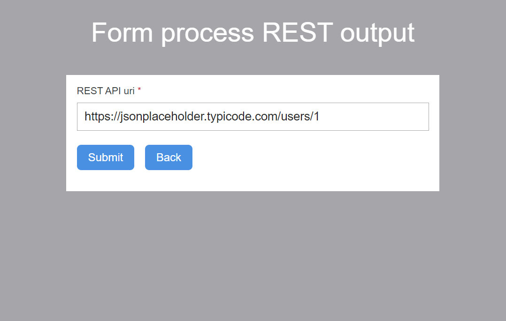

[](https://www.repostatus.org/#wip)

# Onify Blueprint: Form process output from REST API

Example that shows how a process can be started from a form and report back the process using the process output. This is great if you want to give your users a clear view of the results. Here we integrate with a simple REST-API and just return the "raw" JSON result on the screen. 


## Screenshots

### Main form

This is the main form where you enter a URI for the REST API.



### Result form

This is the result coming from the REST API in plain text.


### Flow

This is the BPMN flow that is used.


## Requirements

* Onify Hub v2
* Onify Flow license
* Camunda Modeler 4.4 or later 

## Included

* 1 x Workflows
* 1 x Flows
* 1 x Forms

## Setup

### Copy resources

Copy resource files to your resources folder. Make sure paths are the same.

### Import configuration

Go to the `./config` folder and import the configuration using curl.

**Import the form:**

```bash
curl -X POST "<ONIFY-HUB-API-URL>/api/v2/admin/forms" -H "accept: application/json" -H "authorization: <AUTH-TOKEN>" -H "Content-Type: application/json" -d @form.json
```

**Import the workflow:**

```bash
curl -X POST "<ONIFY-HUB-API-URL>/api/v2/admin/workflows" -H "accept: application/json" -H "authorization: <AUTH-TOKEN>" -H "Content-Type: application/json" -d @workflow.json
```
## Run 

Go to `<ONIFY-HUB-APP-URL>/form/bp-form-process-rest-output` and follow the instructions :-)

## Support

* Community/forum: https://support.onify.co/discuss
* Documentation: https://support.onify.co/docs
* Support and SLA: https://support.onify.co/docs/get-support

## License

This project is licensed under the MIT License - see the [LICENSE](LICENSE) file for details.
